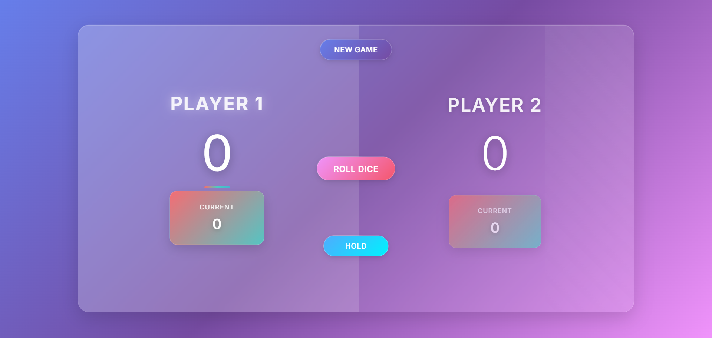

# 🎲 Pig Game

An interactive two-player dice game built with **HTML**, **CSS**, and **Vanilla JavaScript**. This project simulates turn-based logic, dynamic UI updates, and game state management — a great exercise in DOM manipulation and event-driven programming.

---

## 🌐 Live Demo

👉 [**Play the Game**](https://nkiue-pig-game.vercel.app)

Try it out with a friend — first to 100 wins!

---

## 📸 Screenshots



---

## 📖 Game Rules

- 🎯 **Goal**: Be the **first player to reach 100 points**.
- 👥 **Two players take turns** rolling the dice.
- 🎲 On your turn:

  - Roll the dice as many times as you like.
  - Each roll adds to your **current score**.
  - Rolling a **1** ends your turn and resets your current score.
  - Click **"Hold"** to add your current score to your total and pass the turn.

- 🏆 First to **100 points** wins the game!

---

## 🕹️ Controls

| Action        | Button      |
| ------------- | ----------- |
| 🎲 Roll Dice  | `Roll Dice` |
| 💾 Hold Score | `Hold`      |
| 🔄 Reset Game | `New Game`  |

> Dice images update live, and the UI reflects turn changes and winner status.

---

## 📚 What I Learned

This project helped reinforce:

- ✅ DOM selection & manipulation (`querySelector`, `textContent`, `classList`)
- ✅ Game state management and turn switching
- ✅ Conditional logic and loops
- ✅ Event-driven UI updates
- ✅ Clean modular function structure (`init`, `switchPlayer`)

---

## 🛠️ Tech Stack

| Technology            | Usage                                  |
| --------------------- | -------------------------------------- |
| **HTML5**             | Game layout and semantic structure     |
| **CSS3**              | Responsive styling and visual feedback |
| **JavaScript (ES6+)** | Core game mechanics and interactivity  |

---

## 🚀 Getting Started Locally

1. **Clone the repository**:

   ```bash
   git clone https://github.com/nkieu-config/pig-game-project.git
   ```

2. **Open `index.html`** in your browser

3. ✅ **Start playing immediately** — no dependencies or build tools needed

---

## 🧠 Inspired By

🎓 _[The Complete JavaScript Course](https://www.udemy.com/course/the-complete-javascript-course/)_
by [Jonas Schmedtmann](https://codingheroes.io)

---

## ⚠️ Disclaimer

This is a **learning-focused project**, built to practice DOM-based game logic.
All game assets are for educational purposes only.

---

## 📌 License

This project is open-source and available under the [MIT License](LICENSE).

---
